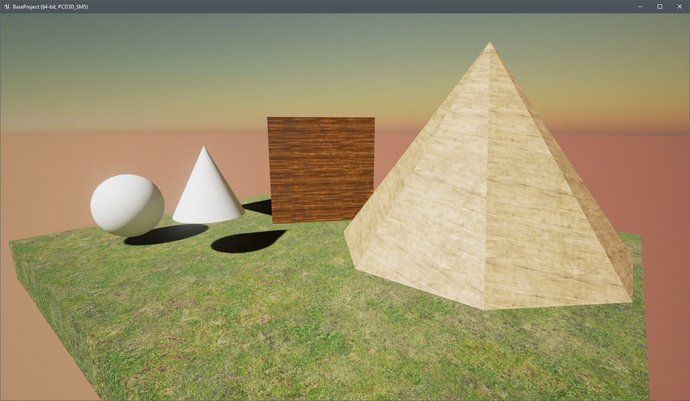

# Unreal Engine 4 - Basic Template

 
This is a *.upack file which can be import to your unreal project.

The StartContent of a empty project is about 640MB which is huge. The *.pack file in this repository is about 10 times smaller it's nice when we want to create a project to realize small experiences

It looks like this

 
